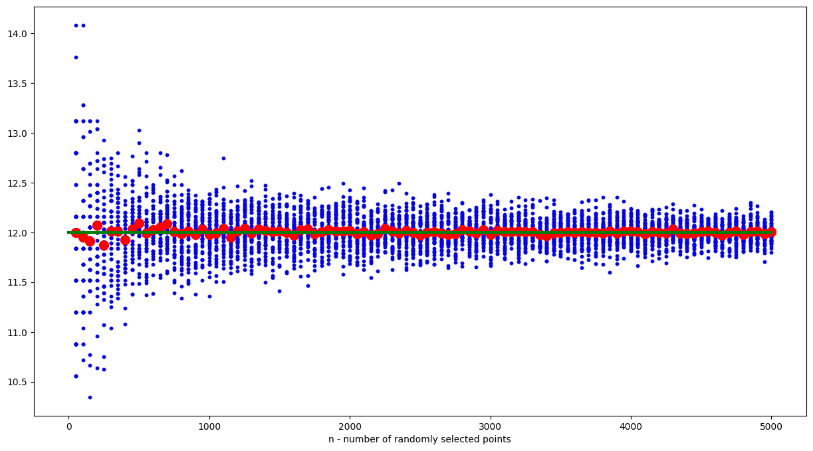
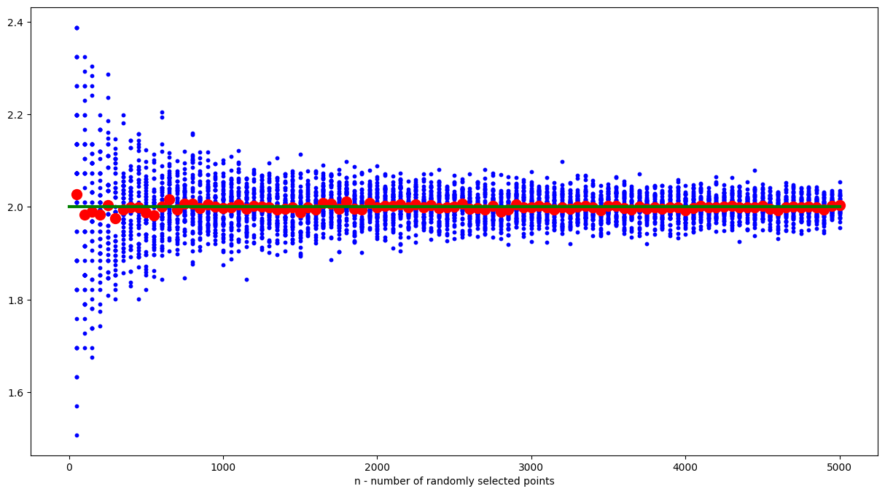
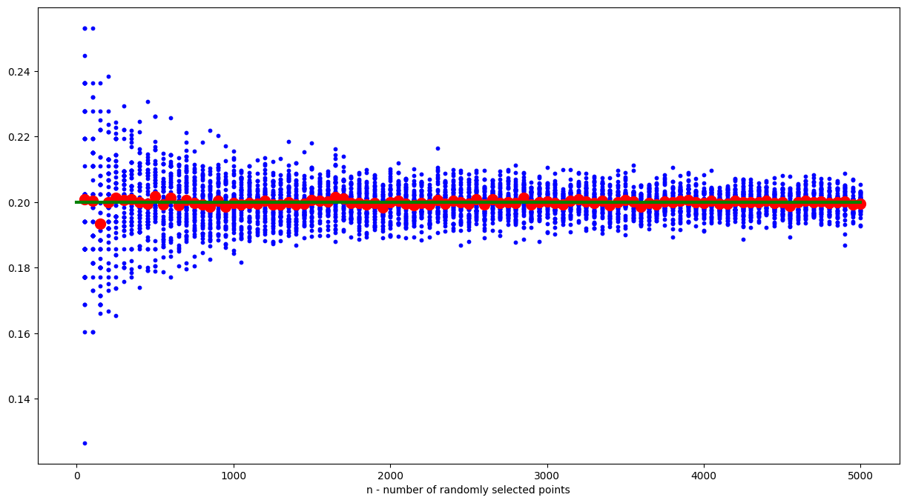
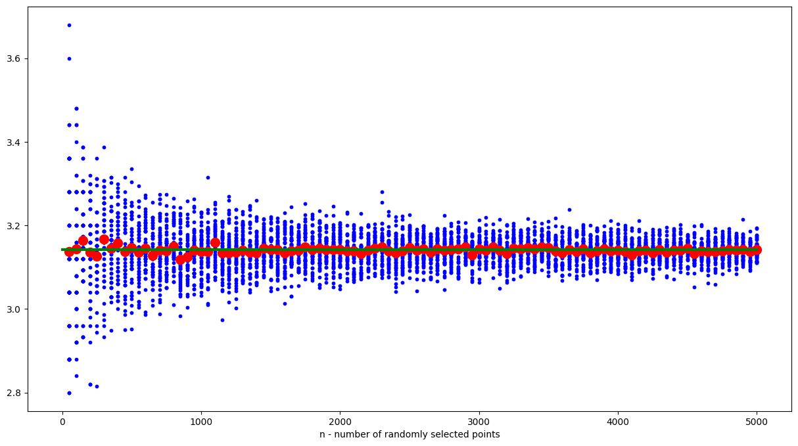

# MPiS - Homework 1

## **Wyniki eksperymentów:**

* Eksperyment 1: Estymacja całki $\left(\int_{0}^{8} \sqrt[3]{x}\ dx\right)$

    > Funkcja na przedziale $[0, 8]$ osiąga maksymalną wartość: $f(8) = 2$, zatem eksperyment dla tej funkcji jest prowadzony na przestrzeni $[0, 8]$ x $[0, 2]$

     

    

    Wartości średnie koncentrują się blisko wartości $12 = \left(\int_{0}^{8} \sqrt[3]{x}\ dx\right)$

 
 

* Eksperyment 2: Estymacja całki $\left(\int_{0}^{\pi} sin(x)\ dx\right)$

    > Funkcja na przedziale $[0, 8]$ osiąga maksymalną wartość: $f(\frac{\pi}{2}) = 1$, zatem eksperyment dla tej funkcji jest prowadzony na przestrzeni $[0, \pi]$ x $[0, 1]$

     

    

    Wartości średnie koncentrują się blisko wartości $2 = \left(\int_{0}^{\pi} sin(x)\ dx\right)$

 
 

* Eksperyment 3: Estymacja całki $\left(\int_{0}^{1} 4x(1 - x)^3\ dx\right)$

    > Funkcja na przedziale $[0, 1]$ osiąga maksymalną wartość: $(\frac{1}{4}) \approx 0.421875$, zatem eksperyment dla tej funkcji jest prowadzony na przestrzeni $[0, 1]$ x $[0, 0.421875]$

     

    

    Wartości średnie koncentrują się blisko wartości $\frac{1}{5}$ = $\left(\int_{0}^{1} 4x(1 - x)^3\ dx\right)$

 
 

* Eksperyment 4: Estymacja liczby $\pi$

    > Eksperyment prowadzony na przestrzeni $[0, 2]$ x $[0, 2]$ oraz dla funkcji 
    > 
    > $f(x, y) = \sqrt{(x - 1)^2 + (y - 1)^2} = d((x, y), (1, 1))$

     

    

    Wartości średnie koncentrują się blisko wartości $3.14159 \approx \pi$

 
 
 

## **Wnioski:**

* Dokładność wyniku zwiększa się wraz z wzrostem liczby wygenerowanych punktów losowych

* Wartości średnie są bliskie wartości oczekiwanych niezależnie od liczby punktów losowych