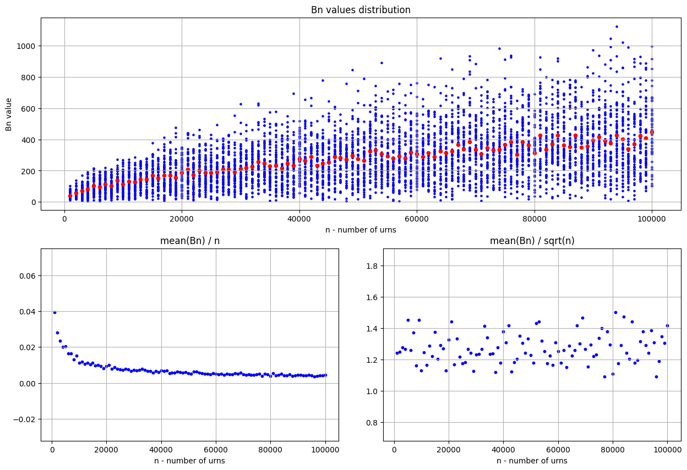
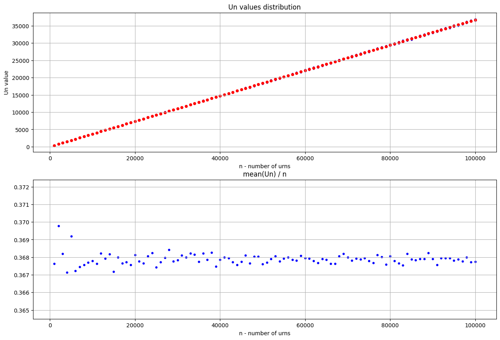
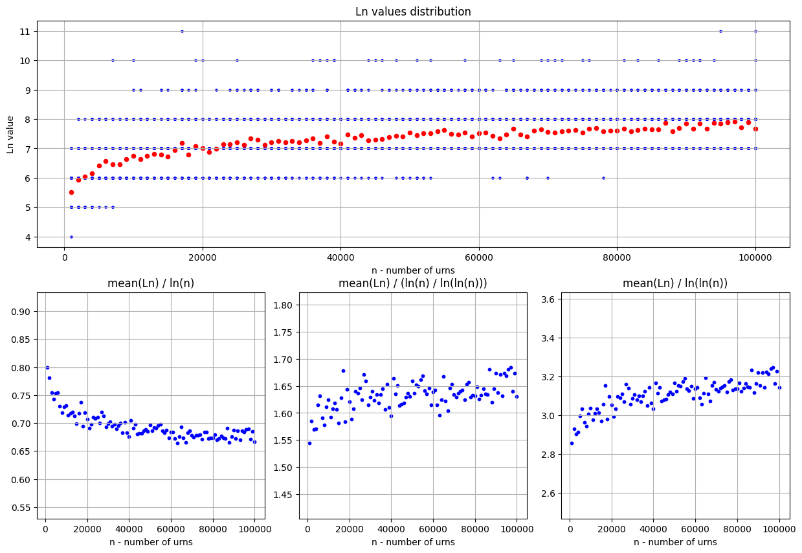
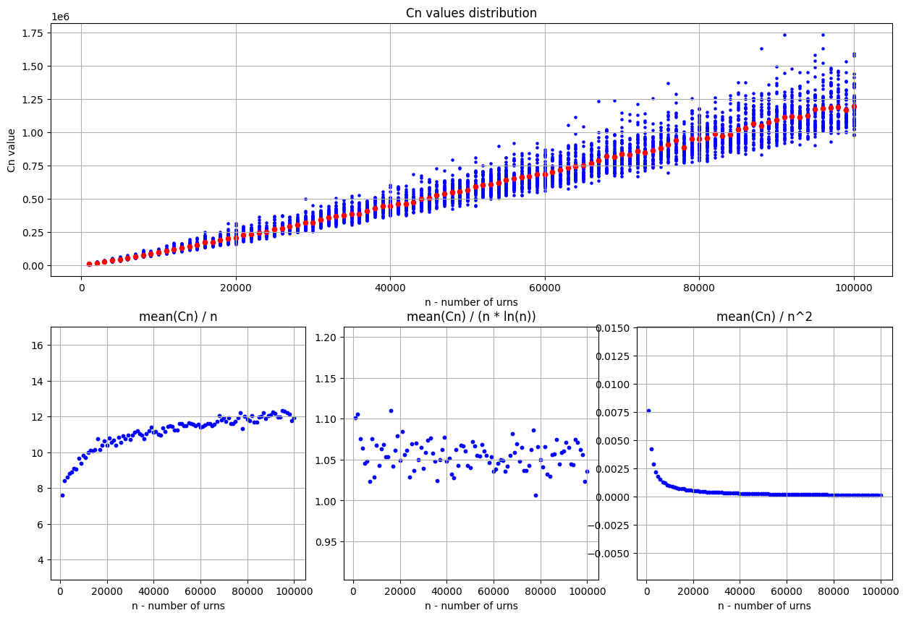
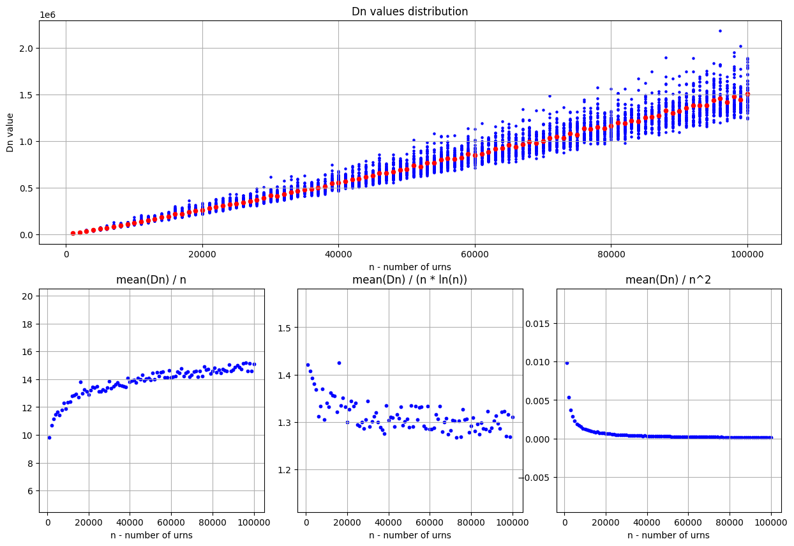
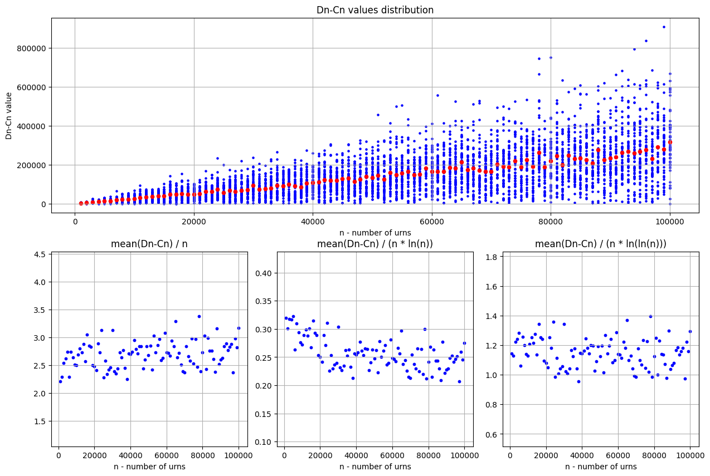

# MPiS - Homework 2:

> Wszystkie wielkości były badane dla "liczba_urn" $\epsilon$ {$1000, 2000, ..., 100000$} w $50$ powtórzeniach dla każdej możliwej wartości $"liczba\_urn"$

 
 

### **1. $B_n$ - Moment pierwszej kolizji (numer kuli, która jako pierwsza wpadła do niepustej urny)** 

> **Birthday paradox:** W teorii prawdopodobieństwa paradoks ten dotyczy prawdopodobieństwa, że w zbiorze $n$ losowo wybranych osób conajmniej dwie osoby będą miały urodziny w tym samym dniu. Paradoks ten polega na tym, że przy grupie $23$ osób, takie prawdopodobieństwo wbrew intuicji przekracza $50\%$.
>
> Można jednak zauważyć, że jeżeli $A \equiv$ "Brak powtórzeń urodzin w grupie" oraz $B \equiv$ "Są powtórzenia urodzin w grupie", to $P(B) = 1 - P(A)$. Wiedząc zatem, że $P(A) = \frac{1}{365^23} * \frac{365!}{(365 - 23)!} \approx 0,492703$ (Ze wszystkich $23$ elementowych permutacji dni w roku wybieramy te, w których nie ma powtórzeń), możemy wyznaczyć $P(B) \approx 1 - 0,492703 \approx 0,507297$ 
> 
> Analogiczne w przypadku eksperymantu z urnami prawdopodobieństwo, że wrzucimy kulę do niepustej urny przy założeniu, że mamy $1000$ urn przekracza $50\%$ dla $38$-ej kuli.

> Znaczenie **birthday paradox** w kontekście funkcji hashujących:
> 
> Paradoks urodzinowy jest wykorzystywany w tzw. **atakach urodzinowych**, który polega na znalezieniu kolizji funkcji hashującej, wiedząc, że zostanie ona znaleziona zdecydowanie szybciej niż by to mógł sugerować rozmiar wartości takich funkcji (hashów) oraz liczba możliwych wartości takich hashów. Mając zatem funkcję hashującą $F$ przediywana liczba kombinacji, którą należałoby sprawdzić, aby znaleźć taką kolizję to $\sqrt{|F^{-1}|}$, a nie $|F^{-1}|$, gdzie $F^{-1} \equiv$ "zbiór wartości F (zbiór możliwych hashów)"

* Koncentracja uzyskanych wyników wokół wartości średniej znacznie maleje wraz z wzrostem liczby urn. 

* Asymptotyka: Z wykresów można wnioskować, że $Avg(B_n) \ \xrightarrow[n \rightarrow \infty]{} +\infty$

> Uzasadnienie:
> 
> Punkty na wykresie $\frac{Avg(B_n)}{\sqrt{n}}$ koncentrują się wokół stałej wartości
> 
> Zatem możemy założyć, że $Avg(B_n) = \Theta(\sqrt{n}) \implies Avg(B_n) \approx c * \sqrt{n} \ (c = constant)$
> 
> Czyli $\lim_{n\to\infty} Avg(B_n) = \lim_{n\to\infty} c * \sqrt{n} = +\infty$

 
 

### **2. $U_n$ - Liczba pustych urn po wrzuceniu $n$ kul**

* Uzyskane wyniki są bardzo silnie skoncentrowane wokół wartości średnich niezależnie od liczby urn

* Asymptotyka: Z wykresów można wnioskować, że $Avg(U_n) \ \xrightarrow[n \rightarrow \infty]{} +\infty$

> Uzasadnienie:
> 
> Punkty na wykresie $\frac{Avg(U_n)}{n}$ koncentrują się wokół stałej wartości
> 
> Zatem możemy założyć, że $Avg(U_n) = \Theta(n) \implies Avg(U_n) \approx c * n \ (c = constant)$
> 
> Czyli $\lim_{n\to\infty} Avg(U_n) = \lim_{n\to\infty} c * n = +\infty$

* Wykres $\frac{Avg(B_n)}{n}$ przedstawia wartości oczekiwane zmiennej losowej $X_i$ takiej, że :
  
  $X_i = 1$ jeżeli $i$-ta urna jest pusta $\wedge \ X_i = 0$ w przeciwnym przypadku

  Wtedy $E(X_i) \approx \frac{Avg(B_n)}{n} \implies \lim_{n\to\infty} E(X_i) = \lim_{n\to\infty} \frac{E(U_n)}{n} = \lim_{n\to\infty} \frac{n * (1-\frac{1}{n})^n}{n} = \\ = \lim_{n\to\infty} (1-\frac{1}{n})^n = \frac{1}{e} \approx 0,36788$ (wokół tej warości skoncentrowane są punkty na wykresie)

 
 

### **3. $L_n$ - Maksymalna liczba kul w urnie po wrzuceniu $n$ kul**

* Uzyskane wyniki są silnie skoncentrowane wokół wartości średnich niezależnie od liczby urn

* Asymptotyka: Z wykresów można wnioskować, że $Avg(L_n) \ \xrightarrow[n \rightarrow \infty]{} +\infty$

> Uzasadnienie:
> 
> Punkty na wykresie $\frac{Avg(L_n)}{\frac{\ln(n)}{\ln(\ln(n))}}$ koncentrują się wokół stałej wartości
> 
> Zatem możemy założyć, że $Avg(L_n) = \Theta(\frac{\ln(n)}{\ln(\ln(n))}) \implies Avg(L_n) \approx c * \frac{\ln(n)}{\ln(\ln(n))} \ (c = constant)$
> 
> Czyli $\lim_{n\to\infty} Avg(L_n) = \lim_{n\to\infty} \frac{\ln(n)}{\ln(\ln(n))} = +\infty$

 
 

### **4. $C_n$ - Minimalna liczba rzutów, po której nie ma żadnej pustej urny**

> **Coupon collector problem:** W teorii prawdopodobieństwa problem zbieracza kuponów opisuje sytuację: Mając pulę $n$ _różnych_ kuponów, ile minimalnie kuponów trzeba wylosować (w losowaniu z powtórzeniami), żeby mieć conajmniej $1$ kupon każdego z $n$ rodzajów?
> 
> W przypadku eksperymantu z urnami problem ten przyjmuje postać: Ile minimalnie kul należy wrzucić do losowo wybieranych (z powtórzeniami) urn, żeby we wszystkich urnach była conajmniej jedna kula?
 

* Koncentracja uzyskanych wyników wokół wartości średniej maleje wraz z wzrostem liczby urn

* Asymptotyka: Z wykresów można wnioskować, że $Avg(C_n) \ \xrightarrow[n \rightarrow \infty]{} +\infty$

> Uzasadnienie:
> 
> Punkty na wykresie $\frac{Avg(C_n)}{n * \ln{n}}$ koncentrują się wokół stałej wartości
> 
> Zatem możemy założyć, że $Avg(C_n) = \Theta(n * \ln{n}) \implies Avg(C_n) \approx c * n * \ln{n} \ (c = constant)$
> 
> Czyli $\lim_{n\to\infty} Avg(C_n) = \lim_{n\to\infty} c * n * \ln{n} = +\infty$

  
 

### **5. $D_n$ - Minimalna liczba rzutów, po której w każdej z urn są conajmniej 2 kule** 

* Koncentracja uzyskanych wyników wokół wartości średniej jest silna dla małej liczby urn, jednak maleje wraz z wzrostem liczby urn

* Asymptotyka: Z wykresów można wnioskować, że $Avg(D_n) \ \xrightarrow[n \rightarrow \infty]{} +\infty$

> Uzasadnienie:
> 
> Wiemy, że:
> 
> * $\ Avg(C_n) \approx c_1 * n * \ln{n} \ \xrightarrow[n \rightarrow \infty]{} +\infty$ 
> * $Avg(D_n - C_n) \approx c_2 * n \ \xrightarrow[n \rightarrow \infty]{} +\infty$
>
> Zatem 
> 
> $\lim_{n\to\infty} Avg(D_n) = \lim_{n\to\infty} (Avg(C_n) + Avg(D_n - C_n)) = \\ = \lim_{n\to\infty} Avg(C_n) + \lim_{n\to\infty} Avg(D_n - C_n) = (+\infty) + (+\infty) = +\infty$

 
 

### **6. $D_n - C_n$ - Liczba rzutów pomiędzy momentami $C_n$ i $D_n$**

* Koncentracja uzyskanych wyników wokół wartości średniej maleje wraz z wzrostem liczby urn

* Asymptotyka: Z wykresów można wnioskować, że $Avg(D_n - C_n) \ \xrightarrow[n \rightarrow \infty]{} +\infty$

> Uzasadnienie:
> 
> Punkty na wykresie $\frac{Avg(D_n - C_n)}{n}$ koncentrują się wokół stałej wartości
> 
> Zatem możemy założyć, że $Avg(D_n - C_n) = \Theta(n) \implies Avg(D_n - C_n) \approx cn \ (c = constant)$
> 
> Czyli $\lim_{n\to\infty} Avg(D_n - C_n) = \lim_{n\to\infty} cn = +\infty$
