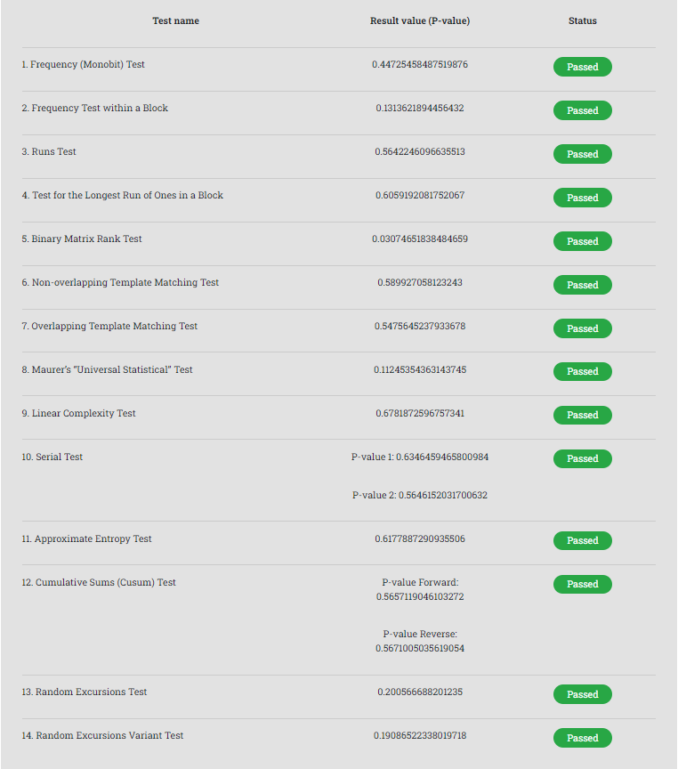
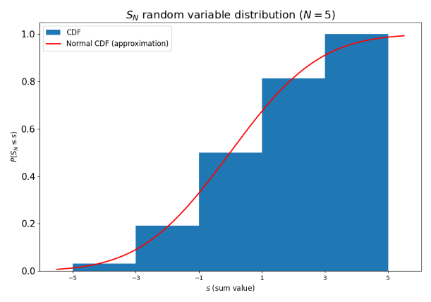
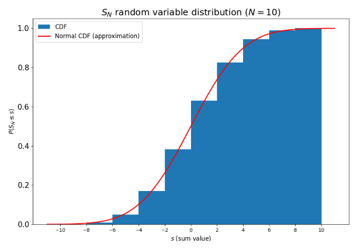
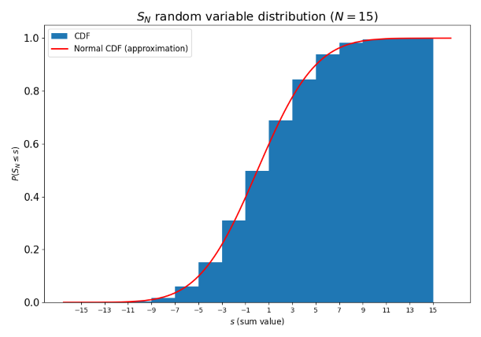
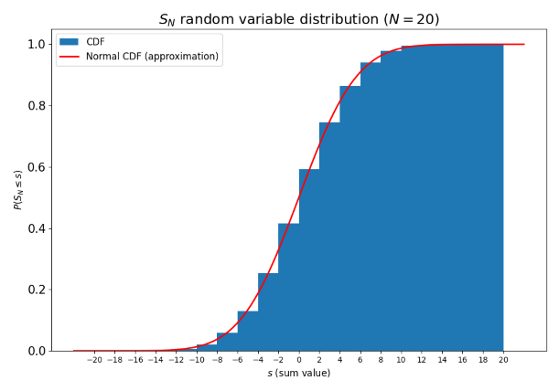
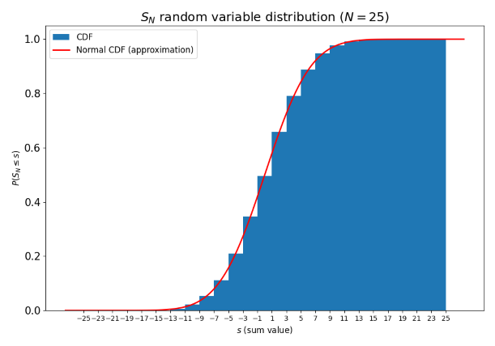
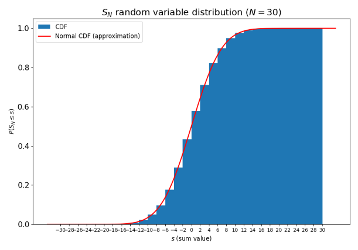
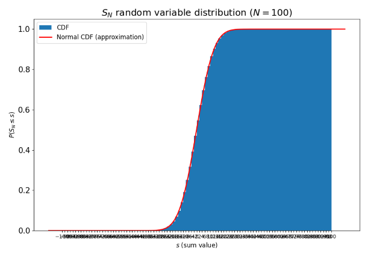
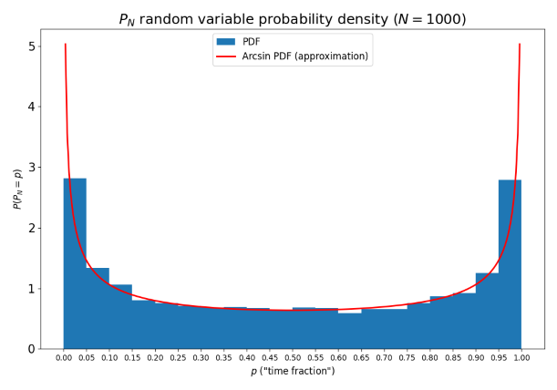
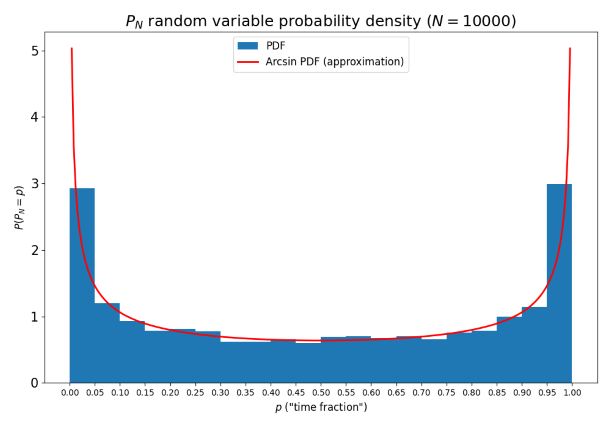

# MPiS - Homework 3:

 

### Zadanie 1: Testowanie losowych ciągów bitów

* Generator `rand()` języka C++ z biblioteki `<random>`

    > Test został przeprowadzony dla ciągi bitów o długości $2 * 10^6$
    >
    > Kod w pliku `hw3_src.cpp`

    Generator nie przeszedł wielu testów, w tym np.:

    * **Test for the longest run of ones in a block** - sprawdzenie najdłuższego ciąg bitów `1`

    * **Binary matrix rank test** - sprawdzenie zależności liniowej między podciągami o stałej długości oryginalnej sekwencji bitów

    To pokazuje, że taki generator ma słabą jakość

 
 

* Generator `numpy.random` języka Python (`Marsynne Twister MT19937`)

    > Test został przeprowadzony dla ciągi bitów o długości $2 * 10^6$
    >
    > Kod w pliku `hw3_src.ipynb`

    Generator przeszedł wszystkie testy, zatem można stwierdzić, że ma on dobre własności statystyczne

 
 

* Hash nazwiska (`SHA1()`)

    > Test został przeprowadzony dla ciągu bitów otrzymanego przez konwersję hasha mojego nazwiska za pomocą `SHA1()`: `44d6c93858d282226d5603e4dfbde042ad261f91`

    Dla wielu testów wynikiem jest `Error`, co sugeruje, że taki ciąg bitów jest zbyt krótki, by móc przeprowadzić taki test.

    Możemy zauważyć, że funkcja `SHA1()` generuje bity z lepszymi właściwościami niż generator liniowy języka C++ i gorszymi niż generator `Marsynne Twister` języka Python

 
 
 

### Zadanie 2: Bładzenie losowe na liczbach całkowitych

> Kod źródłowy w pliku `hw3_src.ipynb`

> Dystrybuantę zmiennej losowej $S_N$ wyznaczono generując $k = 10000$ sum $N$ losowo generowanych wartości ze zbioru $\{-1, 1\}$ dla $N \epsilon \{5, 10, 15, 20, 25, 30, 100\}$. >
> 
> Wyniki zostały porównane z dystrybuantą ciągłej zmiennej losowej o rozkładzie normalnym

 

**Uzyskane wyniki:**

Można zauważyć, że wraz z wzostem wartości $N$ dystrybuanta zmiennej losowej $S_N$ jest coraz bliższa rozkładowi normalnemu.

Zatem ciągła zmienna losowa o rozkładzie normalnym jest aproksymacją dyskretnej zmiennej losowej $S_N$

 
 
 

### Zadanie 3: Bładzenie losowe na liczbach całkowitych - rozkład "czasu nad osią $OX$"

> Kod źródłowy w pliku `hw3_src.ipynb`

> Funkcję masy prawdopodobieństwa zmiennej losowej $P_N$ wyznaczono generując $k = 5000$ "frakcji czasu nad osią $OX$" w bładzeniu losowym (zmienna losowa $S_N$: [zadanie2](#zad2)) dla $N \epsilon \{100, 1000, 10000\}$. 
>
> Wyniki zostały prównane z funkcją gęstośi ciągłej zmiennej losowej o rozkładzie arcusa sinusa.

 

**Uzyskane wyniki:**

Można zauważyć, że wraz z wzostem wartości $N$ funkcja masy prawdopodobieństwa zmiennej losowej $P_N$ jest coraz bliższa funkcji gęstości zmiennej losowej o rozkładzie arkusa sinusa.

Zatem ciągła zmienna losowa o rozkładzie arcusa sinusa jest aproksymacją dyskretnej zmiennej losowej $P_N$

