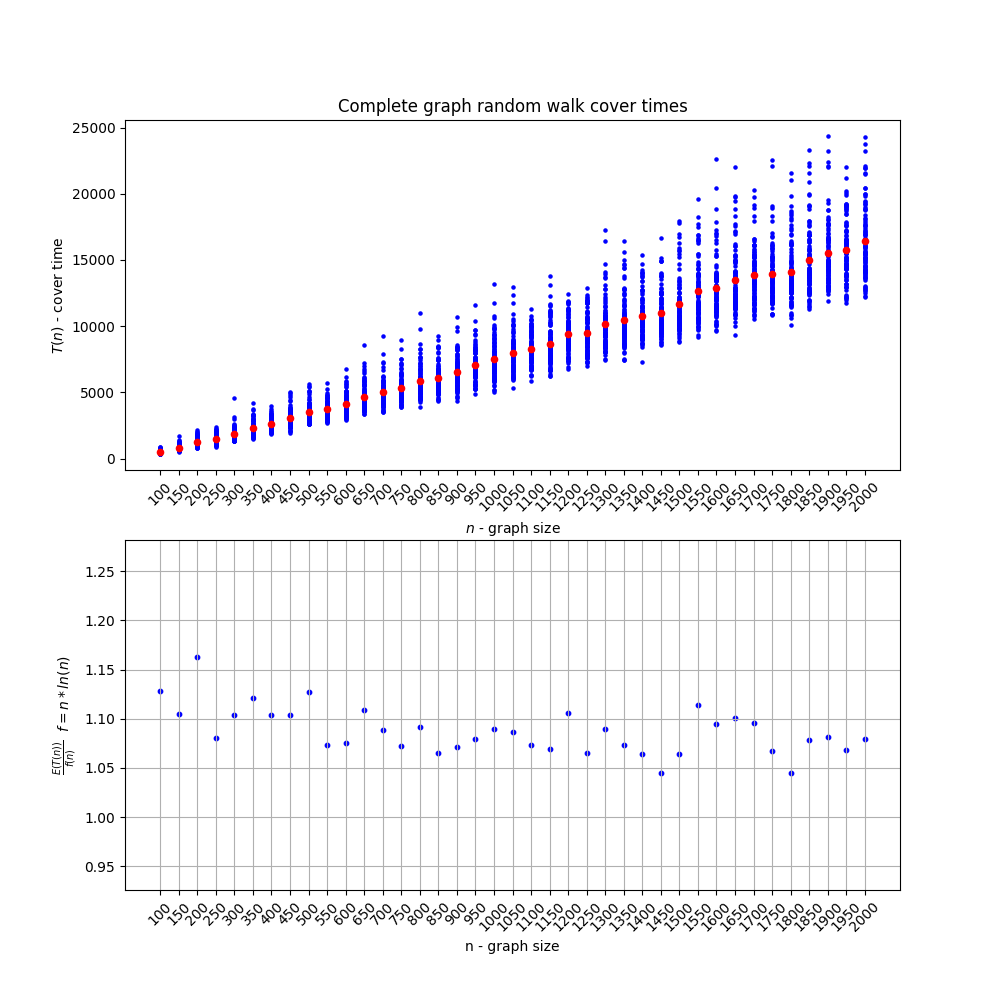
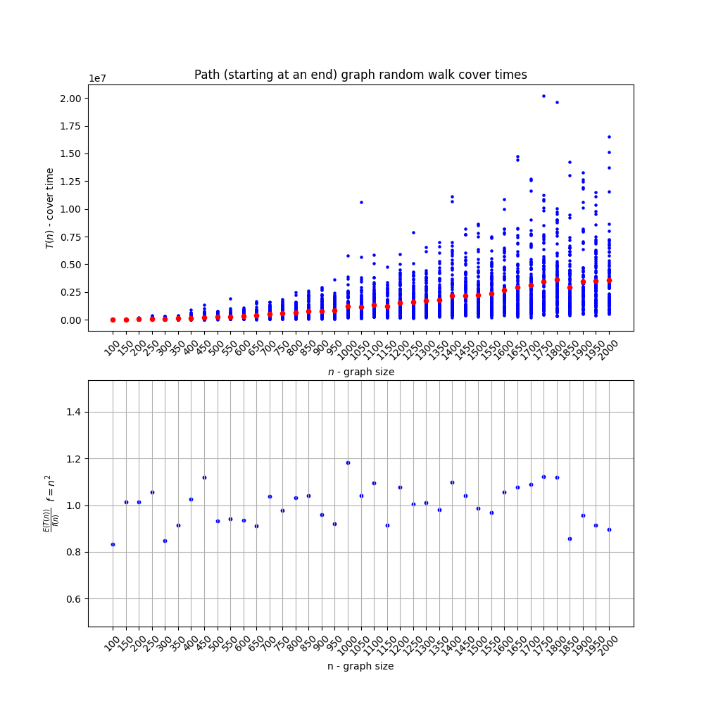
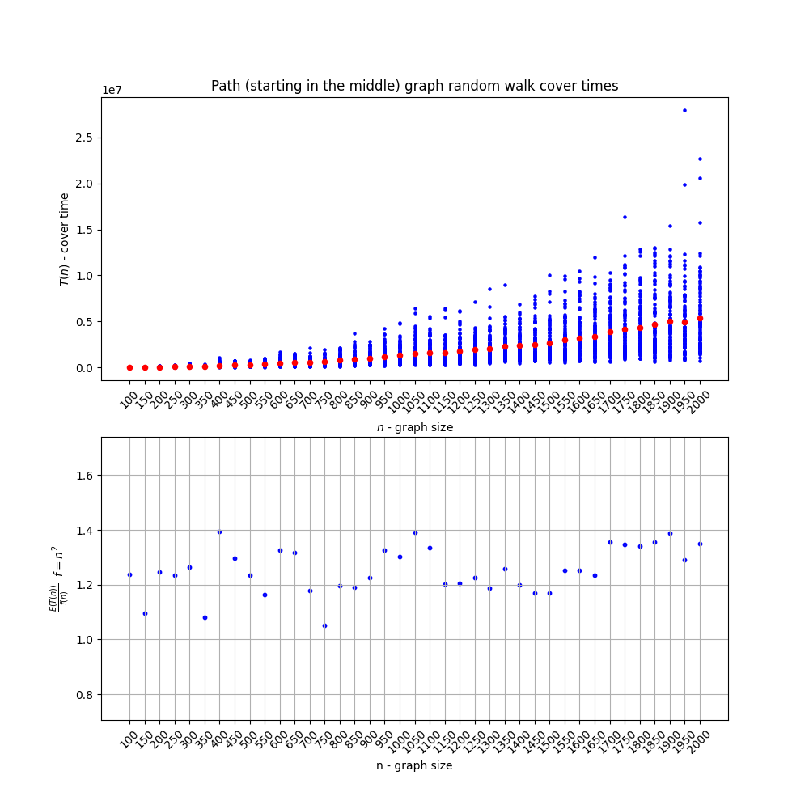
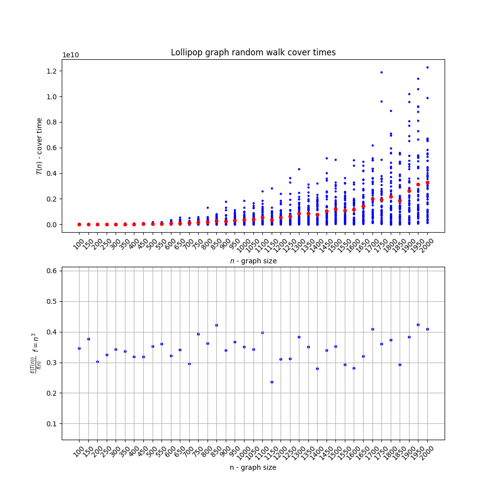

# MPiS - Homework 4:

**Bładzenie losowe na grafach**

Kod źródłowy do zadania: [`hw4_src.cpp`](hw4_src.cpp) oraz [`hw4_src.ipynb`](hw4_src.ipynb)

> Dla każdego z badanych typów grafów zostały wyznaczone wartości czasu pokrycia dla grafów o rozmiarach $n \epsilon {100, 150, ..., 2000}$
> 
> Dla grafów: pełnego, ścieżki oraz dla zupełnego drzewa binarnego dla każdej wartości $n$ zostało wykonancyh po $k = 100$ powtórzeń experymentu, natomiast dla grafu lizakowego zostało wykonanych $k = 50$ powtórzeń

 
 
 

**1. Graf pełny**

> Graf pełny - graf, w którym każde dwa wierzołki są połączone krawędzią

* Koncentracja uzyskanych wyników wokół wartości średniej znacznie maleje wzraz z wzrostem rozmariu grafu

* Złożoność: $E(T(n)) = \Theta(n\ln(n))$
  
  > Uzasadnienie: Punkty na wykresie $\frac{E(T(n))}{n\ln{n}}$ koncentrują się wokół stałej wartości

 
 
 

**2. Ścieżla**

> Ścieżka - graf $G = (V, E)$ o rozmiarze $|V| = n$ taki że $(\forall i \epsilon {1, ..., n - 1})((v_i, v_{i + 1}) \epsilon E)$

* Start w wierzchołku końcowym

* Start w wierzchołku środkowym: $\lfloor \frac{n}{2} \rfloor$

Niezależnie od wierzchołka startowego:

* Koncentracja uzyskanych wyników wokół wartości średniej znacznie maleje wzraz z wzrostem rozmariu grafu 

* Złożoność: $E(T(n)) = \Theta(n^2)$
  
  > Uzasadnienie: Punkty na wykresie $\frac{E(T(n))}{n^2}$ koncentrują się wokół stałej wartości

Jednak wartości $\frac{E(T(n))}{n^2}$ dla startu w wierzchołku końcowym są mniejsze niż dla startu w wierzchołku środkowym, co wynika z tego, że, startując ze środka, algorytm bładzenia losowego musi najpierw odwiedzić jeden z wierzchołków, po czym problem redukuje się do bładzenia losowego startującego na końcu ścieżki

 
 
 

**3. Zupełne drzewo binarne**

> Zupełne drzewo binarne - drzewo binarne, w którym wszystkie poziomy sa wypełnione (jedynym wyjątkiem może być ostatni poziom, który wypełniony jest "od lewej")

* Koncentracja uzyskanych wyników wokół wartości średniej znacznie maleje wzraz z wzrostem rozmariu grafu

* Złożoność: $E(T(n)) = \Theta(n\ln^2(n))$
  
  > Uzasadnienie: Punkty na wykresie $\frac{E(T(n))}{n\ln^2{n}}$ koncentrują się wokół stałej wartości

 
 
 

**4. Lizak**

> Graf $(m,n)$-lizak jest szczególnym rodzajem grafu, składającym się z pełnego wykresu (kliki) na $m$ wierzchołkach i wykresu ścieżki na $n$ wierzchołkach, połączonych mostkiem
>
> Szczególnym przypadkiem grafów $(\frac{2n}{3},\frac{n}{3})$-lizak są znane jako wykresy, które osiągają maksymalny możliwy czas pokrycia

* Koncentracja uzyskanych wyników wokół wartości średniej znacznie maleje wzraz z wzrostem rozmariu grafu

* Złożoność: $E(T(n)) = \Theta(n^3)$
  
  > Uzasadnienie: Punkty na wykresie $\frac{E(T(n))}{n^3}$ koncentrują się wokół stałej wartości